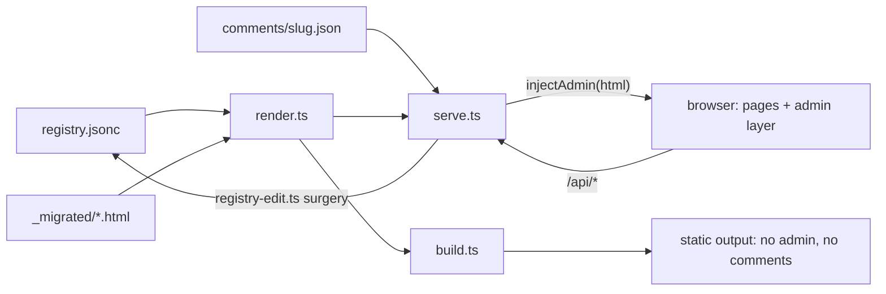

# Interactive Reading Room — design

- Date: 2026-06-10
- Status: approved (design approved in conversation; build proceeding)
- Branch: `worktree-interactive-reading-room`

> Located in `_specs/` (not `docs/`) because `deno task build` empties `docs/` on every run.

## Goal

Make the Reading Room manageable from the browser — review workflow, visibility, removal, and
anchored comments — while keeping the editorial aesthetic untouched and the published static output
free of any management chrome. Add a configurable publish step for pushing the shared subset to a
remote host.

## Decisions (from design conversation)

- **Adding documents stays CLI-only** (the editorial skill + `deno task add-doc`). The browser
  manages what already exists.
- **Comments are anchored marginalia** — attach to a selected passage, rendered as discreet copper
  `§` margin marks.
- **Publish is a configurable command** — build the `visibility:shared` subset, then hand the output
  directory to a user-configured command.
- **Review and visibility are independent toggles.** Promoting out of review does not change
  visibility, and vice versa.
- **Removal is non-destructive** — it deregisters the doc from `registry.jsonc`; the `_migrated/`
  copy stays on disk.
- **Comments never publish** — they are local review apparatus, excluded from static output by
  construction.

## Architecture

One Deno process, still `deno task serve`. The pure rendering core (`render.ts`) and static builder
(`build.ts`) keep their current render path; everything interactive is server-injected, so the
static build cannot grow admin chrome.



### New module: `registry-edit.ts` (pure)

String-surgery editors for `registry.jsonc` that preserve its comments and hand-formatting.
`insertDoc`/`insertTopic` move here from `add-doc.ts` (whose CLI keeps working by importing them),
joined by:

- `setDocField(registry, slug, {review?, visibility?})` — add, change, or drop the
  `review`/`visibility` keys on one doc entry.
- `removeDoc(registry, slug)` — delete one doc entry (handles first / last / only-doc comma cases).
  Topics are left in place even when empty.

All throw on unknown slugs; the server maps those to 404s.

### New module: `comments.ts`

Sidecar comment store, one JSON file per doc at `comments/<slug>.json` (directory created on first
comment). Source HTML is never modified.

Comment shape:

```typescript
interface Comment {
  id: string; // crypto.randomUUID()
  created: string; // ISO timestamp
  quote: string; // exact selected text
  prefix: string; // ~32 chars before the selection
  suffix: string; // ~32 chars after
  note: string; // the annotation body
}
```

Anchoring is W3C-annotation-style text quoting: on page load, client script searches the rendered
text for `prefix + quote + suffix`, falls back to `quote` alone, and treats unresolved comments as
**orphans** — still listed and deletable via the `§ n` popover, never silently lost.

### `serve.ts` additions

- `/api/` routes (below), JSON in/out.
- A post-render step `injectAdmin(html)` that appends the admin CSS/JS layer (new `assets/admin/`
  bundle) to served pages only.
- Registry writes are atomic: write a temp file in the same directory, then rename over
  `registry.jsonc`.
- `READONLY=1` env flag disables all mutation routes (returns 403) for view-only exposure.

## API

- `PATCH /api/docs/<slug>` — body `{review?: boolean, visibility?:
  "private" | "shared"}`. Applies
  registry surgery. 404 unknown slug, 400 bad body.
- `DELETE /api/docs/<slug>` — deregisters the doc. Response notes the `_migrated/` copy remains.
- `GET /api/docs/<slug>/comments` — the sidecar array (empty if none).
- `POST /api/docs/<slug>/comments` — body `{quote, prefix, suffix,
  note}`; server assigns `id` +
  `created`. 404 if slug unregistered.
- `DELETE /api/docs/<slug>/comments/<id>` — remove one comment.

Errors are JSON `{error: string}` with proper status codes. The server stays bound to 127.0.0.1;
over the tailnet the API is as reachable as the pages (single-user tailnet, no separate auth;
`READONLY=1` is the escape hatch).

## UI

All affordances use the existing design tokens (mono labels, copper accents, CSS variables for
paper/espresso themes). Nothing loud, no browser dialogs.

### Index

Pixel-identical by default. A tiny mono **§ Manage** toggle reveals per-card controls styled like
the existing card footers:

- `review on/off` — toggles the For Review pin.
- `private/shared` — toggles publish eligibility.
- `remove` — two-step inline confirm (`remove` → `confirm?`).

### Doc pages

The injected breadcrumb bar gains a right-aligned cluster:

- Review state chip — click toggles review; clearing it is "promote".
- `§ n` annotation count — click opens a popover listing all comments (including orphans) with
  jump-to-anchor and delete.

### Marginalia

Select a passage → floating `§ annotate` affordance → minimal paper-styled note input. Saved
comments render as copper `§` marks in the margin at their anchors; click reveals the note and its
delete control.

## Publish

`deno task publish [--dry-run]`:

1. Build the `visibility:shared` subset into `.publish/` (gitignored; the local full build in
   `docs/` is untouched). `build.ts` gains optional out-dir and visibility-filter parameters,
   defaults unchanged.
2. If `publish.jsonc` exists — `{"cmd": ["aws", "s3", "sync", "{out}",
   "s3://…"]}` with `{out}`
   substituted — run it. Otherwise print the output directory and a hint. `--dry-run` builds and
   prints the command without running it.

## Testing

- `registry-edit_test.ts` — surgery preserves comments/formatting; set/clear review and visibility;
  remove first/last/only doc; unknown slug throws; idempotency.
- `comments_test.ts` — store CRUD, missing-file behavior, bad input.
- Handler-level API tests — export `handler` from `serve.ts`; exercise PATCH/DELETE/comments
  round-trips, 404s, `READONLY=1` 403s, using a temp-dir fixture registry.
- Build-filter test — shared-only corpus filtering.
- Guard test — static build output contains **no admin markers** and no comment data.
- Existing tests (render, partials, add-doc, drift) keep passing.

## Non-goals

- No in-browser document authoring or upload.
- No editing of comment text after creation (add/delete only).
- No auth layer; trust the tailnet boundary.
- No framework, no client build step.
