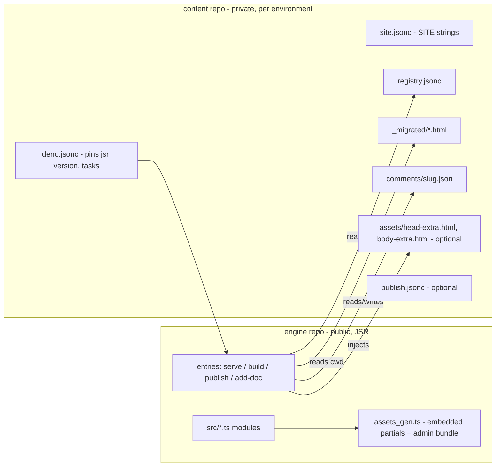

# Reading Room as a packaged engine — design

- Date: 2026-06-10
- Status: approved (design approved in conversation; build proceeding)
- Branch: `package-extraction`

> Located in `_specs/` (not `docs/`) because `deno task build` empties
> `docs/` on every run.

## Goal

Turn the Reading Room into a reusable engine published to JSR, so that
multiple environments (a personal library, a work library) share one
codebase and differ only in content and light visual customization.
Eliminates the recurring two-repo manual port: features land once in
the engine, and every environment picks them up with a version bump.

## Decisions (from design conversation)

- **Distribution is a JSR package** — `@tlockney/reading-room`,
  published publicly from this repo via GitHub Actions. Engine code is
  open; all content (registries, documents, comments) stays in private
  per-environment content repos.
- **Partial customization is additive slots, not overrides.** The
  packaged canonical editorial head/body bundle always injects exactly
  as today. Consumers may add `assets/head-extra.html` /
  `assets/body-extra.html`, injected into their own marked regions.
  No shadowing — the skill-drift invariant and healing stay meaningful
  in every environment.
- **This repo becomes the engine repo.** Its content half (registry,
  `_migrated/`, comments) moves to a new private personal content
  repo. The work library converts to a consumer the same way.
- **`SITE` becomes config** — loaded from the consumer's `site.jsonc`
  instead of a constant in `render.ts`.
- **Assets ship embedded** — generated TypeScript string modules, not
  runtime file reads (JSR modules cannot `Deno.readTextFile`
  package-relative paths). No runtime fetch, works offline, no extra
  permissions.
- **`deno task add-doc` keeps its name and flags** so the
  `editorial-longform-html` skill's Reading Room integration keeps
  working untouched.

## Architecture



### Package surface

Runnable entry points (operate on the consumer's cwd):

- `jsr:@tlockney/reading-room/serve` — live server + management API
- `jsr:@tlockney/reading-room/build` — static build (full corpus)
- `jsr:@tlockney/reading-room/publish` — shared-subset build + configured command
- `jsr:@tlockney/reading-room/add-doc` — register a standalone editorial doc

Library modules exported for scripting: `render`, `build`, `comments`,
`registry-edit`, plus the canonical partials as exported string values
(consumed by content-repo drift tests).

### Root and config resolution

Every entry point resolves the content root to `Deno.cwd()` (the
consumer repo). `ROOT`-derived constants in `render.ts` become a
`resolveRoot()`/context value threaded through the modules. `SITE`
loads from `<root>/site.jsonc`:

```jsonc
{
  "title": "The Reading Room",
  "eyebrow": "Reference Library",
  "lede": "…",
  "footer": ["…", "…", "…"]
}
```

Missing `site.jsonc` falls back to the current generic defaults, so a
bare content repo still serves.

### Asset embedding (codegen)

A `deno task gen` step in the engine repo turns `assets/editorial/*`
and `assets/admin/*` into `src/assets_gen.ts` (exported string
constants). The generated file is committed and published. An
engine-side test pins generated ↔ source so they cannot drift.
`render.ts` / `admin.ts` import the constants instead of reading disk.

### Additive slots

Two new marked regions, same strip-then-inject idempotency as the
editorial bundle:

- `<!-- RR-LOCAL-HEAD:start/end -->` — consumer `assets/head-extra.html`,
  injected before `</head>` after the editorial head bundle.
- `<!-- RR-LOCAL-BODY:start/end -->` — consumer `assets/body-extra.html`,
  injected before `</body>` after the editorial body bundle.

Slots are included in static builds and published output (they are
content, not management chrome). Absent files mean absent regions —
healing strips stale regions. The admin layer remains serve-only and
unembeddable in builds, unchanged.

### Skill / drift story

The package exports `EDITORIAL_HEAD` / `EDITORIAL_BODY` canonical
strings. Each content repo keeps a small drift test comparing the
installed engine version's bundle against
`~/.claude/skills/editorial-longform-html/assets/engineering-reference.html`
(skip-if-absent). The skill is thereby pinned to a semver'd canonical
rather than whatever is on local disk. The vendored `skill/` copy in
this repo remains the skill's source of truth for development; the
engine's partials and the skill template are pinned together by the
existing drift test, now engine-side.

## Consumer repo layout

```
deno.jsonc          # pins jsr:@tlockney/reading-room; tasks delegate to entries
site.jsonc          # SITE strings
registry.jsonc      # the corpus
_migrated/          # the documents
comments/           # annotation sidecars (committed; repo is private)
assets/head-extra.html, body-extra.html   # optional slots
publish.jsonc       # optional remote-publish command
agent.sh            # thin launchd wrapper around the packaged serve
```

Consumer `deno.jsonc` tasks keep today's names: `serve`, `build`,
`publish`, `add-doc`, `test`.

## Publishing

- JSR package `@tlockney/reading-room`, semver from `deno.jsonc`
  `version`. Publish via GitHub Actions (`jsr publish` with OIDC) on
  tag push.
- Consumers pin an exact or caret version; upgrading an environment is
  a one-line bump.

## Migration order

1. **Extract the engine in this repo**: move modules under `src/`,
   thread root/config, add asset codegen, add slots, add JSR metadata
   and publish workflow. Full existing test suite keeps passing
   against a fixture content dir.
2. **Split personal content** into a new private repo
   (`reading-room-library` or similar); convert it to consumer shape;
   verify round-trip (serve, manage, annotate, publish).
3. **Convert the work repo** (`metron/reading-room`) to a consumer:
   delete engine files, add `site.jsonc` with the Metron strings,
   pin the package. Annotations, review tracking, and remote publish
   arrive there as a side effect — the previously scoped file-by-file
   port never happens.

Steps 2–3 finalize only after the first JSR publish; until then,
consumer verification uses a local path import.

## Testing

- The full suite (render injection, registry surgery, comments,
  handler API, build-purity guards, layout, anchors) lives in the
  engine repo, exercised against temp-dir fixture content.
- New engine tests: codegen pin (generated ↔ source), slot injection
  idempotency + healing, `site.jsonc` loading + defaults, root
  resolution from cwd.
- Content repos keep only: drift test (skill ↔ installed engine
  canonical) and a smoke test (`build` succeeds against the real
  registry).

## Non-goals

- No private-registry support; the engine is public by design.
- No partial shadowing/override mechanism.
- No theme system beyond the slots; visual customization is whatever
  CSS a consumer injects via `head-extra.html`.
- No in-browser authoring (unchanged from the interactive design).
- No multi-site serving from one process.
